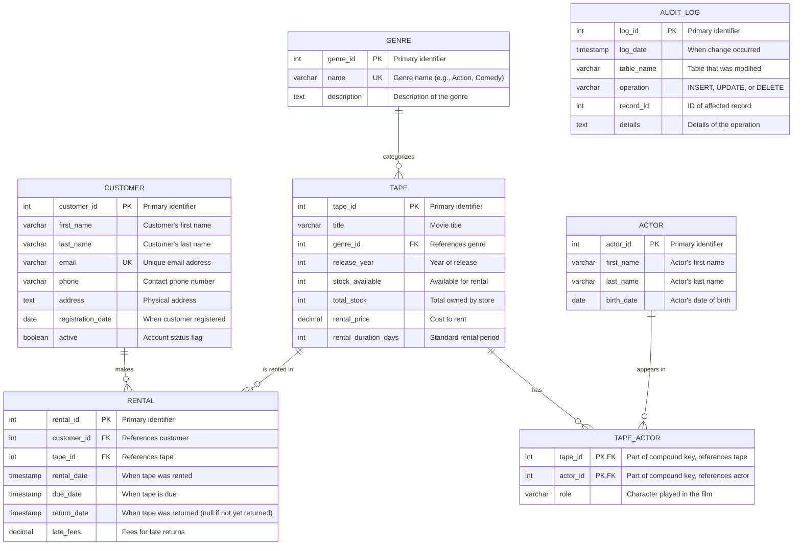

# Entity-Relationship Diagram for Random Play Video Tape Store

This diagram represents the conceptual data model for the Random Play video tape store database. The model captures the essential entities, their attributes, and relationships for a video tape rental business.

## ER Diagram

## Entity Descriptions

### CUSTOMER
Represents individuals who rent tapes from the store. Each customer has a unique identifier, personal information (name, contact details), and account status. The registration date helps track customer history and loyalty.

### TAPE
Represents the physical VHS tapes available for rental. Each tape has identifying information about the movie it contains (title, genre, release year), inventory information (stock levels), and rental terms (price, duration). The stock_available field is crucial for tracking which tapes can be rented at any given time.

### GENRE
Represents categories of films (e.g., Action, Comedy, Drama, Horror) to help organize the inventory and assist customers in finding tapes of interest. A simple classification system that allows for browsing the collection by type.

### RENTAL
Tracks the transactions between customers and tapes. This entity captures when a tape was rented, when it's due back, when it was actually returned, and any late fees assessed. Active rentals have a null return_date, making it easy to query for outstanding rentals.

### ACTOR
Stores information about performers who appear in the movies. This allows customers to find movies featuring their favorite actors.

### TAPE_ACTOR
A junction table that establishes the many-to-many relationship between tapes and actors. Includes the role played by the actor in that specific film, providing additional information for customers interested in particular performances.

### AUDIT_LOG
Tracks system changes for auditing purposes. This isn't directly related to the core business logic but provides a security and accountability layer, recording who made what changes to the database.

## Relationships

1. **CUSTOMER to RENTAL**: One-to-many. A customer can make multiple rentals over time, but each rental belongs to exactly one customer. This allows for tracking a customer's rental history.

2. **TAPE to RENTAL**: One-to-many. A specific tape (copy) can be rented multiple times (sequentially), and each rental involves exactly one tape. This tracks the rental lifecycle of each physical tape.

3. **GENRE to TAPE**: One-to-many. A genre can categorize multiple tapes, but each tape is assigned to exactly one genre. This simplifies the classification system while allowing for genre-based browsing.

4. **TAPE to TAPE_ACTOR**: One-to-many. A tape (movie) can feature multiple actors, and the TAPE_ACTOR junction table records each relationship.

5. **ACTOR to TAPE_ACTOR**: One-to-many. An actor can appear in multiple tapes (movies), and the TAPE_ACTOR junction table records each relationship.

## Design Considerations

1. **Stock Management**: The system tracks both total_stock (how many copies the store owns) and stock_available (how many can be rented right now) to manage inventory effectively.

2. **Late Fee Handling**: The RENTAL entity includes fields for tracking due dates and late fees, supporting the store's policies on timely returns.

3. **Audit Logging**: The AUDIT_LOG entity provides a transaction history for security and troubleshooting, tracking changes to all important entities.

4. **Data Integrity**: Foreign key relationships ensure that rentals can only reference valid customers and tapes, preventing orphaned records.

5. **Email Uniqueness**: Customer emails are defined as unique keys, preventing duplicate accounts and allowing for email-based account lookup. 